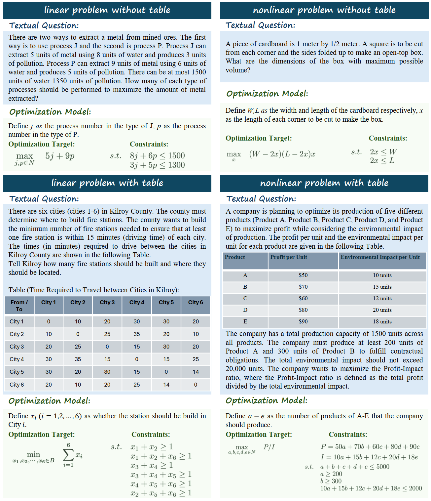
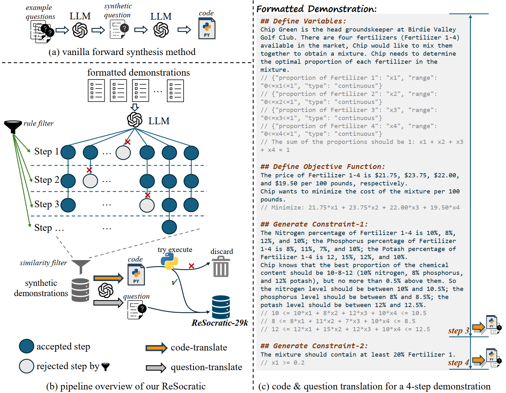

# Benchmarking LLMs for Optimization Modeling and Enhancing Reasoning via Reverse Socratic Synthesis

This repository contains the code and data for the paper [OptiBench Meets ReSocratic: Measure and Improve LLMs for Optimization Modeling](https://arxiv.org/pdf/2407.09887v2). In this work, we propose a new benchmark (**OptiBench**) for evaluating the performance of large language models (LLMs) on optimization modeling tasks. Furthermore, to alleviate the data scarcity for optimization problems, and to bridge the gap between open-source LLMs on a small scale (e.g., Llama-2-7b and Llama-3-8b) and closedsource LLMs (e.g., GPT-4), we further propose a novel data synthesis method namely **ReSocratic**. Experimental results show that the our ReSocratic significantly improves the performance of solving optimization problems.


## News
<!-- - 🔥 [2024.7] Paper updated with more detail. [Read the paper here.](). -->
- 🔥 [2024.6] We released the code of **ReSocratic** along with its corresponding synthetic data.
- 🔥 [2024.5] Based on the previous competition track, we contributed a more challenging and diverse benchmark (**OptiBench**) with a wider range of question types.
- 🔥 [2024.4] We launch the competition track of [Automated Optimization Problem-Solving with Code](https://www.codabench.org/competitions/2438/) in [AI for Math Workshop and Challenges](https://sites.google.com/view/ai4mathworkshopicml2024) at [ICML 2024](https://icml.cc/Conferences/2024).


## OptiBench Benchmark
We propose a high-quality benchmark named **OptiBench** for optimization problems with complex samples in multiple forms. As far as we know, this is the first large-scale benchmark to measure the model’s end-to-end solving ability in optimization problems including nonlinear and tabular data. OptiBench features linear programming (linear), non-linear optimization problems (non-linear), and table content as in industrial use (table), resulting in a comprehensive and versatile benchmark for LLM optimization problem-solving.



*A initial version of this benchmark serves as a competition track of [ICML 2024 AI4MATH Workshop](https://www.codabench.org/competitions/2438/)*


## ReSocratic Synthesis
We introduce **ReSocratic**, a novel data synthesis method for eliciting diverse and reliable data. The main idea of ReSocratic is to synthesize an optimization problem with step-by-step generation in a reverse manner from our elaborate formatted demonstrations to questions.


**(a)** The forward data synthesis method is to synthesize the question first, and then let the
LLM generate the answer to the synthetic question. **(b)** In contrast, the reverse data synthesis method
we propose, ReSocratic, first synthesizes carefully designed formatted demonstrations, and then transforms
the synthesized demonstrations into code (answers) and questions. **(c)** Our carefully designed demonstrations are
structured in a step-by-step manner, with each step containing a natural language description as well
as the corresponding formalized mathematical content. Starting from the third step of the synthetic
scenario, each subsequent step is transformed into a question-code pair.


We synthesize the <i>**ReSocratic-29k**</i> dataset with 29k samples by using our ReSocratic. The synthetic data can be seen in the `synthetic_data` folder.

## Performance on OptiBench Benchmark
We show performance on our OptiBench benchmark for different LLMs. The results are shown in the table below. The code pass rate is the percentage of the code that successfully executes.


<table align="center">
<tr align="center">
<th align="center">Model</th> <th>Linear w/ Table</th> <th>Linear w/o Table</th> <th>Nonlinear w/ Table</th> <th>Nonlinear w/o Table</th> <th>All</th> <th>Code Pass</th>
</tr>
<tr align="center">
<td colspan=7 align="center" bgcolor=#4C4C4C><b><i>Zero-shot Prompt</i></b></td>
</tr>
<tr align="center">
<td><code>Llama-3-8B-Instruct</code></td> <td>0.29%</td> <td>0.0%</td> <td>0.0%</td> <td>0.0%</td> <td>0.17%</td> <td>8.8%</td>
</tr>
<tr align="center">
<td><code>Llama-3-70B-Instruct</code></td> <td>50.0%</td> <td><b>76.9%</b></td> <td>32.0%</td> <td>30.8%</td> <td>59.5%</td> <td>86.8%</td>
</tr>
<tr align="center">
<td><code>DeepSeek-V2</code></td> <td>27.5%</td> <td>40.4%</td> <td>18.0%</td> <td>29.3%</td> <td>34.4%</td> <td>74.0%</td>
</tr>
<tr align="center">
<td><code>GPT-3.5-Turbo</code></td> <td>37.5%</td> <td>68.1%</td> <td>16.0%</td> <td>19.5%</td> <td>49.1%</td> <td>85.0%</td>
</tr>
<tr align="center">
<td><code>GPT-4</code></td> <td><b>62.5%</b></td> <td>75.4%</td> <td><b>32.0%</b></td> <td><b>42.1%</b></td> <td><b>62.8%</b></td> <td><b>88.8%</b></td>
</tr>
<tr align="center">
<td colspan=7 align="center" bgcolor=#4C4C4C><b><i>Few-shot Prompt</i></b></td>
</tr>
<tr align="center">
<td><code>Llama-3-8B-Instruct</code></td> <td>2.5%</td> <td>17.8%</td> <td>8.0%</td> <td>11.3%</td> <td>13.6%</td> <td>26.9%</td>
</tr>
<tr align="center">
<td><code>Llama-3-70B-Instruct</code></td> <td>57.5%</td> <td>79.2%</td> <td>32.0%</td> <td>33.8%</td> <td>62.5%</td> <td>91.2%</td>
</tr>
<tr align="center">
<td><code>DeepSeek-V2</code></td> <td>56.3%</td> <td>79.5%</td> <td>32.0%</td> <td>27.1%</td> <td>61.0%</td> <td>85.5%</td>
</tr>
<tr align="center">
<td><code>GPT-3.5-Turbo</code></td> <td>40.0%</td> <td>75.4%</td> <td>26.0%</td> <td>28.6%</td> <td>56.4%</td> <td><b>93.2%</b></td>
</tr>
<tr align="center">
<td><code>GPT-4</code></td> <td><b><u>71.3%</u></b></td> <td><b><u>80.7%</u></b></td> <td><b>34.0%</b></td> <td><b><u>34.6%</u></b></td> <td><b><u>65.5%</u></b></td> <td>88.3%</td>
</tr>
<tr align="center">
<td colspan=7 align="center" bgcolor=#4C4C4C><b><i>SFT with Synthetic Data</i></b></td>
</tr>
<tr align="center">
<td><code>Llama-2-7B-Chat</code></td> <td>11.3%</td> <td>40.6%</td> <td>32.0%</td> <td>15.8%</td> <td>30.6%</td> <td>93.7%</td>
</tr>
<tr align="center">
<td><code>Llama-3-8B-Instruct</code></td> <td><b>32.5%</b></td> <td><b>63.5%</b></td> <td><b><u>44.0%</u></b></td> <td><b>33.0%</b></td> <td><b>51.1%</b></td> <td><b>96.3%</b></td>
</tr>
</table>


## Setup
Clone our repository and install the required packages.
```bash
git-lfs clone https://github.com/yangzhch6/ReSocratic.git
cd ReSocratic
pip install -r requirements.txt
```


## Evaluation in Zero-shot and Few-shot Settings
Eval GPT 
```
python gpt_baseline.py 
    --model_name "gpt-4" or "gpt-3.5-turbo" 
    --prompt_path "prompt/solve/scip_zeroshot.txt" or "prompt/solve/scip_fewshot.txt"
```

Eval Llama
```
CUDA_VISIBLE_DEVICES=0,1 python llama{2/3}_baseline.py \
    --prompt_path "prompt/solve/scip_zeroshot.txt" or "prompt/solve/scip_fewshot.txt" \
    --model_name_or_path "model_path" \
    --output_path "results.json" \
    --tensor_parallel_size 4 \
    --batch_size 8 
```


## Synthesis Process of ReSocratic

Synthesize demonstrations
```
python resocratic_synthesize.py \
    --pool_path "prompt/synthesis/pool/{linear/nonlinear}.json"
```

Translate demonstrations to questions
```
python synthesize_question.py \
    --data_path "synthetic demonstrations path" \
    --output_path "output file path"
```

Translate demonstrations to code
```
python synthesize_code.py \
    --data_path "synthetic demonstrations path" \
    --output_path "output file path"
```

## SFT
sft Llama-2-7b-Chat
```
bash scripts/train_llama2.sh
```

sft Llama-3-8b-Instruct
```
bash scripts/train_llama3.sh
```